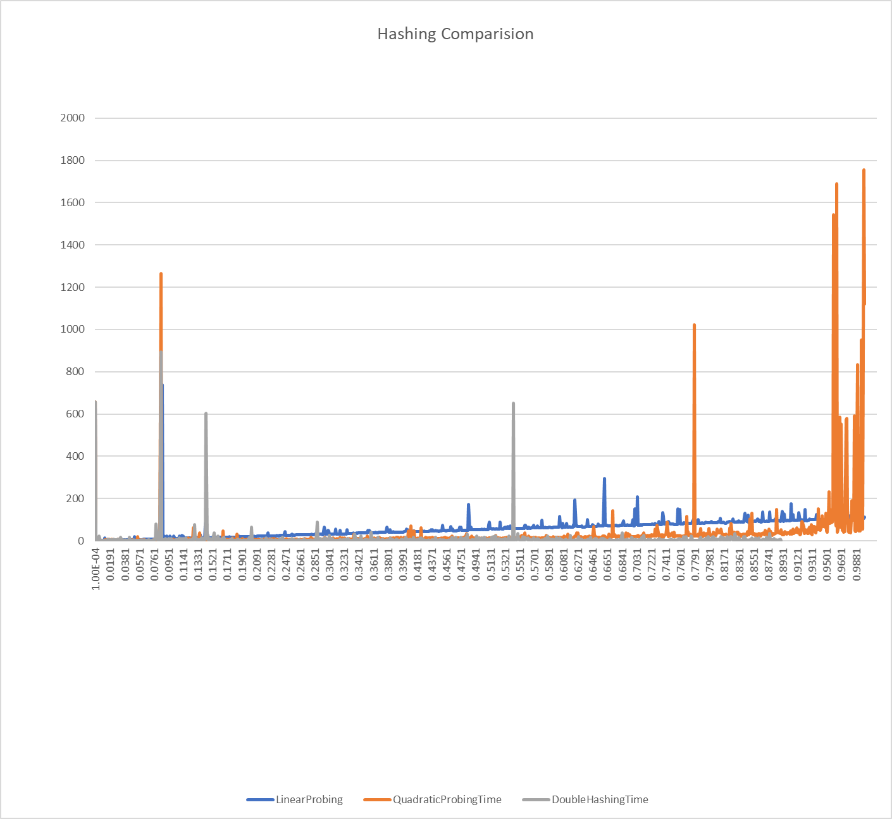

# Hashing
### This Project aims to make a detailed study of hashing techniques like linear probing,quadratic probing and Double Hashing.
It also aims to study their performance once the size of the array is doubled.For more details go through the reports.
    
 ### X-axis represents the load factor
 ### Y-axis represents the the number of input values
 
